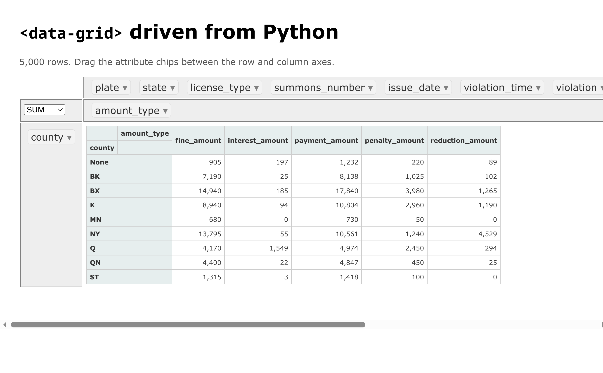

# Data Grid
```<data-grid>``` is a [web component](https://www.webcomponents.org/) written
in [es6](http://kangax.github.io/compat-table/es6/) to quickly explore **large**,
[narrow](https://en.wikipedia.org/wiki/Wide_and_narrow_data#Narrow), datasets in your browser.

```<data-grid>``` started as a clean-room reimplementation of
[PivotTable.js](https://pivottablejs.org/examples/) to explore how
[Web SQL](https://www.w3.org/TR/webdatabase/) could lift its
[size limitations](https://github.com/nicolaskruchten/pivottable/wiki/Frequently-Asked-Questions#input-data-size).
Unfortunately, Web SQL was [deprecated](https://developer.chrome.com/blog/deprecating-web-sql)
so ```<data-grid>``` now depends on [`@sqlite.org/sqlite-wasm`](http://sqlite.org/wasm)
thanks to the magic of [WebAssembly](https://webassembly.org/).

## Live demo

[](https://bur.gy/data-grid/)

**[bur.gy/data-grid](https://bur.gy/data-grid/)** &mdash; no Jupyter, no server.
[PyScript](https://pyscript.net/) fetches the NYC open parking violations
dataset, reshapes it with pandas, and pushes it into ```<data-grid>```, all in
the browser. Source: [`examples/pyscript.html`](examples/pyscript.html).

(GitHub renders the image above as a static screenshot &mdash; markdown cannot
run the component inline, so follow the link for the real thing.)

### Browser requirements
By default ```<data-grid>``` stores its database in the
[Origin Private File System](https://developer.mozilla.org/en-US/docs/Web/API/File_System_API/Origin_private_file_system),
which sqlite-wasm reaches through `SharedArrayBuffer`. The page must therefore be
served [cross-origin isolated](https://developer.mozilla.org/en-US/docs/Web/API/Window/crossOriginIsolated)
(`Cross-Origin-Opener-Policy: same-origin` and `Cross-Origin-Embedder-Policy: require-corp`).
Loading a database from `data-source` additionally uses
[`Uint8Array.fromBase64`](https://developer.mozilla.org/en-US/docs/Web/JavaScript/Reference/Global_Objects/Uint8Array/fromBase64),
which needs Chrome 133, Firefox 133 or Safari 18.2.

GitHub Pages cannot send those two headers. Where you cannot control them, set
`data-vfs="memdb"` to keep the database in memory &mdash; you lose persistence
across reloads but need no isolation at all, which is how the demo above runs.
The alternative is a service worker that injects the headers
([`coi-serviceworker`](https://github.com/gzuidhof/coi-serviceworker)).

| `data-vfs` | persists | needs COOP/COEP |
| --- | --- | --- |
| `opfs` (default) | yes | yes |
| `memdb` | no | no |


## Using Data Grid
### HTML5
```<data-grid>``` consists of a single
[javascript module](https://developer.mozilla.org/en-US/docs/Web/JavaScript/Guide/Modules).
The module registers several custom elements (5 to be precise) but only
```<data-grid>``` is really useful
```html
<!DOCTYPE html>
<head>
    <script type="module" src="js/dataGrid.js"></script>
</head>
<body>
    <data-grid data-name="myTable" data-db-name="myDatabase"></data-grid>
</body>
```

### PyScript
Because ```<data-grid>``` is just a custom element, anything that can reach the
DOM can drive it &mdash; including Python running in the browser under
[PyScript](https://pyscript.net/). No kernel, no widget protocol, no server:
```python
from pyodide.ffi import to_js
from pyscript import document, window

grid = document.querySelector("data-grid")
await window.customElements.whenDefined("data-grid")
while grid.dbId is None:          # set once the sqlite worker has opened the db
    await window.setTimeout_async(50)

await grid.createTable(to_js(fields, dict_converter=window.Object.fromEntries))
await grid.bulkInsert(to_js(columns), to_js(rows))
await grid.refresh()
```
See [`examples/pyscript.html`](examples/pyscript.html) for the whole thing, and
`npm run build:demo` to build it. Unlike the Jupyter path this needs no
`DataGridWidget`, so `anywidget` is not involved at all.

### Jupyter
```<data-grid>``` also ships as an [anyywidget](https://anywidget.dev/).
```python
from data_grid import DataGridWidget

# assume you have a sqlite database called examples/example.db
DataGridWidget(table="fines", db="example", source="/api/contents/examples/example.db")
```
```DataGridWidget``` implements two-way binding with ```<data-grid>```. You can set ```.col_axis```
or ```.row_axis``` in a separate cell and watch the output respond asynchronously.

Testing `DataGridWidget` is unfortunately finicky because of
[CORS](https://developer.mozilla.org/en-US/docs/Web/HTTP/Guides/CORS) restrictions.
One approach is to run [`jupyter lab`](https://jupyter.org/try#jupyterlab)
and [Vite](https://vite.dev) side-by-side and leverage Vite's
[`server.proxy`](https://vite.dev/config/server-options.html#server-proxy) to
route most request to jupyter.

JupyterLab is a tool this project is developed *against*, not something it
imports, so it is deliberately not a locked dependency — run it on demand and
you get a current version rather than whatever this repository last pinned:
```sh
uv run --with jupyterlab jupyter lab
```

This requires editing `jupyter_lab_config.py`:
```python
## Set the Access-Control-Allow-Origin header
#  
#          Use '*' to allow any origin to access your server.
#  
#          Takes precedence over allow_origin_pat.
#  Default: ''
c.ServerApp.allow_origin = 'http://localhost:5173'

## Supply overrides for the tornado.web.Application that the Jupyter server uses.
#  Default: {}
c.ServerApp.tornado_settings = {
    'headers': {
        'Cross-Origin-Embedder-Policy': 'require-corp',
        'Cross-Origin-Opener-Policy': 'same-origin',
    }
}
```